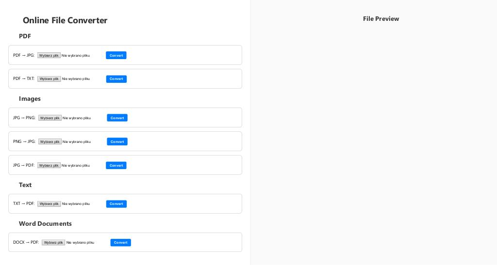
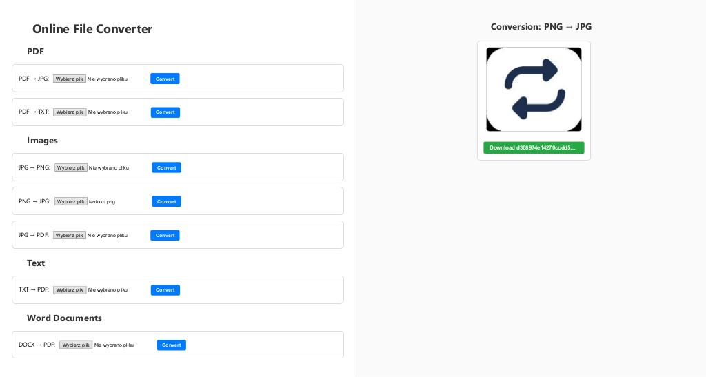

# 🔄 Online File Converter

A simple, modular file converter built with Node.js. A web application that allows users to quickly convert popular file formats like PDF, DOCX, TXT, JPG, PNG, and more.

> Designed with ease of extension in mind.

---

## 📦 Key Features

- ✅ File conversions:

| Category        | Supported conversions                      |
|----------------|---------------------------------------------|
| 📄 PDF         | PDF ➜ JPG, PDF ➜ TXT                        |
| 🖼️ Images      | JPG ➜ PNG, PNG ➜ JPG, JPG ➜ PDF             |
| 📝 Text        | TXT ➜ PDF                                   |
| 🧾 Word        | DOCX ➜ PDF                                  |

- 📂 Output preview after conversion
- ⚡ Simple and intuitive HTML + CSS interface
- 🔌 Modular structure with clear separation of logic
- 🛠️ Easy to configure and extend

---

## 🛠️ Technologies Used

| Technology       | Purpose                                |
|------------------|----------------------------------------|
| **Node.js + Express** | Backend server and routing         |
| **Multer**           | File upload handling                |
| **pdf-poppler**      | PDF to image/text conversion        |
| **pdfkit**           | PDF file generation                 |
| **pdf-parse**        | PDF text parsing                    |
| **sharp**            | Image processing and conversion     |
| **fs-extra**         | Enhanced file system utilities      |
| **path**             | File path resolution                |
| **nodemon**          | Auto server restart in dev mode     |

---

## 📁 Project Structure

```
OnlineConverter/
├── output/                       # Converted output files
├── uploads/                      # Temporary uploaded files
├── screenshots/                    
├── src/
│   ├── config/
│   │   ├── constants.js
│   │   └── multer-config.js
│   ├── controllers/
│   │   ├── cleanupController.js
│   │   └── conversionController.js
│   ├── helpers/
│   │   ├── fileHelper.js
│   │   ├── htmlHelper.js
│   │   ├── imageHelper.js
│   │   └── pdfHelper.js
│   ├── middlewares/
│   │   └── fileValidation.js
│   ├── routes/
│   │   ├── apiRoutes.js
│   │   └── mainRoutes.js
│   ├── services/
│   │   ├── cleanupService.js
│   │   └── conversionService.js
│   └── app.js
├── index.html
├── style.css
├── favicon.png
├── .gitignore
├── package.json
└── README.md
```

---

## 🧼 Automatic File Cleanup

The application includes a background service that removes old temporary files from `uploads/` and `output/` directories.

- `FILE_TTL` (file lifetime) and `CLEANUP_INTERVAL` are configurable in `config/constants.js`.
- Files older than the defined threshold are automatically deleted.

```js
setInterval(() => cleanupService.cleanupOldFiles(), CLEANUP_INTERVAL);
```

---

## 🛡️ File Validation

Each upload request goes through validation middleware to ensure only appropriate file types are processed.

Example route:

```js
router.post('/pdf-to-jpg',
  upload.single('pdf'),
  fileValidation.validatePdf,
  conversionController.pdfToJpg
);
```

Available validators:

| Middleware         | Validates         |
|-------------------|-------------------|
| `validatePdf`     | `.pdf` files      |
| `validateImage`   | `.jpg`, `.png`    |
| `validateText`    | `.txt` files      |
| `validateDocx`    | `.docx` files     |

---

## 🚀 Local Setup

### 1. Clone the repository
```bash
git clone https://github.com/Jaroslaw-Baumgart/OnlineConverter.git
cd OnlineConverter
```

### 2. Install dependencies
```bash
npm install
```

### 3. Install LibreOffice and Poppler

#### Ubuntu / Debian:
```bash
sudo apt install libreoffice unoconv poppler-utils
```

#### macOS:
```bash
brew install --cask libreoffice
brew install poppler unoconv
```

#### Windows:
- [Download LibreOffice](https://www.libreoffice.org/download/download/) and add `C:\Program Files\LibreOffice\program` to `PATH`.
- [Download Poppler](https://github.com/oschwartz10612/poppler-windows/releases) and add `C:\poppler\bin` to `PATH`.

---

### 4. Run the application
```bash
npm run start
```

Then open your browser at:
```
http://localhost:3000
```

---

## 📷 Screenshots

Main app interface with available conversions:






---

## 🔮 Future Plans

- Migrate frontend to **React + TypeScript**
- State management with **Zustand** or **Jotai**
- Batch file conversions
- Docker support
- User authentication and rate limits
- End-to-end testing

---

## 📬 Contact

- **GitHub**: [Jaroslaw-Baumgart](https://github.com/Jaroslaw-Baumgart)
- **Email**: [jaroslawbaumgart@gmail.com](mailto:jaroslawbaumgart@gmail.com)
